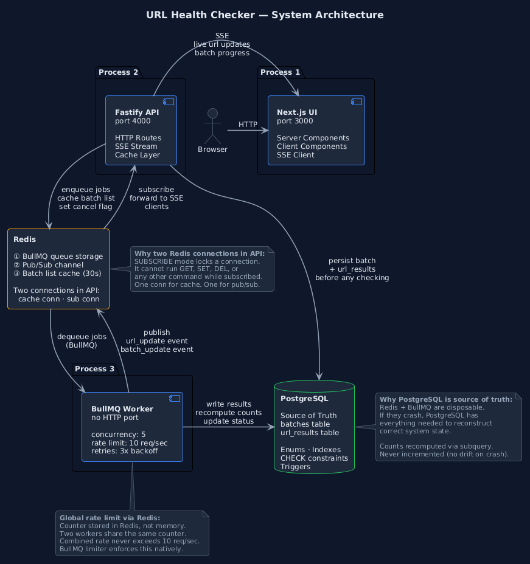

# URL Health Checker

Paste a list of URLs, check each one in the background, and watch the results stream into the browser as they finish.



---

## Table of Contents

- [Features](#features)
- [Quick Start](#quick-start)
- [Architecture](#architecture)
- [Tech Stack and Why](#tech-stack-and-why)
- [Key Design Decisions](#key-design-decisions)
- [Horizontal Scaling](#horizontal-scaling)
- [Constraints](#constraints)
- [Trade-offs and Future Work](#trade-offs-and-future-work)

---

## Features

- Submit up to **500 URLs** by pasting them or uploading a CSV
- For each URL, capture the **HTTP status code**, **response time**, and **page title**
- **Live results** in the browser as each URL finishes (SSE)
- **Cancel** a running batch at any time
- **Retry failed** URLs only, without re-running the ones that succeeded

---

## Quick Start

**Prerequisites:** Docker and Docker Compose

```bash
docker compose up --build -d
```

Then open **http://localhost:3000**.

The database schema is created automatically on first run.

To stop everything:

```bash
docker compose down
```

---

## Architecture

The system runs as three separate processes that communicate through Redis and PostgreSQL.

```
Browser (Next.js :3000)
        │  SSE
        ▼
Fastify API (:4000) ──────── PostgreSQL
        │
        ▼
      Redis
        │
        ▼
BullMQ Worker ────────────── PostgreSQL
```

| Process       | Port | Responsibility                              |
|---------------|------|---------------------------------------------|
| Next.js UI    | 3000 | Renders pages and receives live updates     |
| Fastify API   | 4000 | Handles HTTP only. Never checks URLs.       |
| BullMQ Worker | —    | Checks URLs only. Never handles HTTP.       |

### Why three processes?

Node.js runs on a single thread. If the API checked 100 URLs itself while also serving requests, everything would block. So the API only does four things: receive the request, save it to the database, push the work onto a queue, and respond immediately. The worker runs separately and does all the actual checking.

---

## Tech Stack and Why

### PostgreSQL — source of truth

- Stores all batches, URL results, and statuses permanently
- Redis and BullMQ hold only temporary processing state, so they can be wiped and rebuilt without losing data
- **Data integrity is enforced in the database:**
  - Enums restrict status fields to valid values
  - `CHECK` constraints keep completed counts between 0 and the total
  - A **partial index** covers only pending URLs, so the index stays small as work completes

### Redis — queue storage, pub/sub, cache

| Use      | Purpose                                                           |
|----------|-------------------------------------------------------------------|
| Queue    | Stores BullMQ jobs so they survive worker crashes                  |
| Pub/Sub  | Fans out URL updates to every API instance                         |
| Cache    | Caches the batch list for 30s, invalidated on any related write    |

The API uses **two Redis connections**, because a connection in `SUBSCRIBE` mode cannot run normal commands. One handles caching and the other handles pub/sub.

### BullMQ — background jobs

- Exponential retry backoff: **1s → 2s → 4s**
- Concurrency of **5 jobs** per worker
- Global rate limit of **10 requests/sec**, stored in Redis so it holds across multiple workers

### Server-Sent Events — live updates

- Traffic is almost entirely server → client, so SSE is simpler than WebSockets here
- Combined with Redis pub/sub, updates reach clients on any API instance with **no sticky sessions** required

---

## Key Design Decisions

### 1. Idempotent job submission

On first enqueue, each job gets a **deterministic ID** based on its database row UUID. If the same POST arrives twice (double-click, network retry), BullMQ sees the existing job ID and skips the duplicate.

**Retry Failed** uses a separate enqueue path with **no job ID**, because those URLs genuinely need to run again, and deduplication would silently drop them.

### 2. Two-phase cancel

At cancel time, a job is in one of two states:

| State       | Where it lives           | How it's cancelled                                                      |
|-------------|--------------------------|-------------------------------------------------------------------------|
| Queued      | Waiting in Redis          | DB status set to `cancelled`; the worker checks this before starting     |
| In-flight   | Being processed by worker | A Redis flag is set; the worker checks it at the start of each job       |

Either phase alone misses one of the two cases.

### 3. Recompute counts, never increment

Batch `completed` and `failed` counts are recalculated with a SQL subquery against `url_results` instead of `completed = completed + 1`. Incrementing drifts if a worker crashes between writing the result and updating the count. Recomputing from the source data is always correct, whatever crashed.

### 4. Next.js server/client boundary

- The **batch list** and **batch detail** pages are server components. They fetch data before anything reaches the browser, so opening a batch in a new tab shows the correct state immediately with no spinner.
- The **live update** section is a client component. It receives the initial data as props, then subscribes to SSE.

---

## Horizontal Scaling

```
Load Balancer
 ├── API Instance 1 ──┐
 ├── API Instance 2 ──┼──── Redis ──── Worker(s) ──── PostgreSQL
 └── API Instance 3 ──┘
```

- **Multiple API instances** work with no code changes. They share PostgreSQL, and all subscribe to the same Redis channel, so every instance receives every update and pushes it to its own connected browsers.
- **Rate limiting** stays globally correct because the counter lives in Redis, not in process memory.
- **Workers** scale by adding processes. Concurrency is per process (5 each), so two workers give 10 parallel checks, while the 10 req/sec global limit still holds.
- **Connection pooling:** at `max: 10` per instance, 10 API instances would reach PostgreSQL's default limit of 100 connections. At that scale, PgBouncer would go in front of PostgreSQL.

---

## Constraints

- Only `http://` and `https://` URLs are accepted
- Maximum URL length is **2048** characters
- Page titles are extracted only from `text/html` responses with a **2xx** status
- Cancel is immediate for queued jobs. In-flight jobs may finish a few milliseconds after cancel, which is acceptable.
- Auth, notifications, and UI polish are out of scope per the brief

---

## Trade-offs and Future Work

| Area                   | Current state                                        | With more time                                                                 |
|------------------------|------------------------------------------------------|--------------------------------------------------------------------------------|
| Migrations             | Schema runs once from a SQL file on first startup     | Versioned migrations with `node-pg-migrate`                                    |
| Cache stampede         | Not handled; an expired cache sends all requests to PostgreSQL | Redis `SET NX` lock so only one request rebuilds the cache              |
| Retry classification   | Every failure retried 3 times, including 404s         | Retry transient errors (timeouts, connection errors); skip permanent 4xx       |
| Connection pool size   | Hardcoded to 10 per process                           | Derived from `max_connections` ÷ instance count, set via env variable          |
| Observability          | None                                                  | Prometheus metrics for queue depth, job duration, and SSE connection count     |
